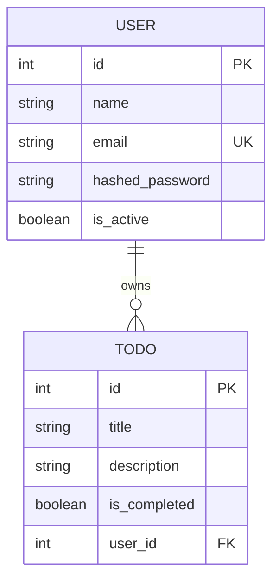

# Todo List API

A RESTful API for managing personal to-do lists. Users can register, log in,
receive a JWT access token, and create, read, update, or delete only their own
tasks.

This project was built as part of the
[roadmap.sh Todo List API project](https://roadmap.sh/projects/todo-list-api).

## Features

- User registration and login
- JWT bearer-token authentication
- Password hashing with bcrypt
- User-owned todos: users cannot access or modify another user's tasks
- Create, read, update, and delete todos
- Pagination for the todo list endpoint
- Input validation with Pydantic
- SQLite database managed through SQLAlchemy
- Automated integration testing with pytest

## Tech Stack

- Python
- FastAPI
- SQLAlchemy
- SQLite
- Pydantic
- Passlib and bcrypt
- Python-Jose for JWTs
- Pytest

## Project Structure

```text
todo-list-api/
+-- app/
|   +-- main.py                 # FastAPI application entry point
|   +-- config.py               # Environment-based settings
|   +-- database.py             # SQLAlchemy engine, session, and get_db dependency
|   +-- models/
|   |   +-- db.py               # SQLAlchemy User and Todo models
|   |   +-- schemas.py          # Pydantic request and response schemas
|   +-- routes/
|   |   +-- auth_routes.py      # Register, JSON login, and Swagger login routes
|   |   +-- todo_routes.py      # Protected todo CRUD routes
|   +-- services/
|   |   +-- user_service.py     # User database operations
|   |   +-- todo_service.py     # Todo database operations
|   +-- utils/
|       +-- security.py         # Password hashing and JWT helpers
+-- tests/
|   +-- test_auth.py            # Authentication integration test
+-- requirements.txt
+-- README.md
```

## Setup

Make sure Python 3.10 or newer is installed.

```bash
git clone https://github.com/jaimzh/python-projects.git
cd python-projects
cd todo-list-api
```

Create and activate a virtual environment:

```bash
python -m venv venv
```

Windows PowerShell:

```powershell
.\venv\Scripts\Activate.ps1
```

macOS/Linux:

```bash
source venv/bin/activate
```

Install dependencies:

```bash
pip install -r requirements.txt
```

Create a `.env` file in the project root:

```env
SECRET_KEY=replace-this-with-a-long-random-secret
ALGORITHM=HS256
ACCESS_TOKEN_EXPIRE_MINUTES=60
```

## Run the API

```bash
uvicorn app.main:app --reload
```

The API will be available at:

```text
http://127.0.0.1:8000
```

FastAPI also provides interactive documentation:

```text
http://127.0.0.1:8000/docs
```

## API Endpoints

### Authentication

| Method | Endpoint | Description |
| --- | --- | --- |
| `POST` | `/auth/register` | Create an account and return a JWT access token |
| `POST` | `/auth/login` | Log in with JSON and return a JWT access token |
| `POST` | `/auth/token` | OAuth2 form login for Swagger's Authorize button |

Register:

```json
POST /auth/register
{
  "name": "Jane Doe",
  "email": "jane@example.com",
  "password": "strong-password"
}
```

Successful response:

```json
{
  "access_token": "your-jwt-token",
  "token_type": "bearer"
}
```

Log in:

```json
POST /auth/login
{
  "email": "jane@example.com",
  "password": "strong-password"
}
```

### Todos

All todo endpoints require this header:

```text
Authorization: Bearer <access_token>
```

| Method | Endpoint | Description |
| --- | --- | --- |
| `POST` | `/todos/` | Create a todo |
| `GET` | `/todos/?page=1&limit=10` | Get the current user's todos |
| `GET` | `/todos/{todo_id}` | Get one todo owned by the current user |
| `PUT` | `/todos/{todo_id}` | Update a todo owned by the current user |
| `DELETE` | `/todos/{todo_id}` | Delete a todo owned by the current user |

Create a todo:

```json
POST /todos/
{
  "title": "Learn FastAPI",
  "description": "Build and test a Todo List API"
}
```

Update a todo:

```json
PUT /todos/1?is_completed=true
{
  "title": "Learn FastAPI",
  "description": "Finished the authentication and testing sections"
}
```

Paginated response:

```json
{
  "data": [
    {
      "id": 1,
      "title": "Learn FastAPI",
      "description": "Build and test a Todo List API",
      "is_completed": false,
      "user_id": 1
    }
  ],
  "page": 1,
  "limit": 10,
  "total": 1
}
```

## Authentication and Authorization

Passwords are never stored directly. They are hashed with bcrypt before being
saved in the database.

After registration or login, the API returns a JWT access token. Protected
todo routes read the bearer token, validate it, find the current user, and use
that user's ID when querying todos.

This is important because authentication and authorization are different:

- **Authentication:** confirms who the user is by validating their JWT.
- **Authorization:** checks whether that user owns the todo they want to read,
  update, or delete.

For example, trying to update another user's todo returns `403 Forbidden`,
while requesting a missing todo returns `404 Not Found`.

## Database Design

The API uses SQLite through SQLAlchemy.



Each todo has a `user_id` foreign key pointing to its owner. This relationship
is what lets the API keep each user's tasks separate.

## Testing

The project includes an automated integration test for a failed login attempt.
It registers a user, attempts to log in using the wrong password, and confirms
the API returns `401 Unauthorized`.

Run the test:

Windows PowerShell:

```powershell
.\venv\Scripts\python.exe -m pytest tests\test_auth.py -q -p no:cacheprovider
```

macOS/Linux:

```bash
python -m pytest tests/test_auth.py -q
```

The test uses its own SQLite database, so it does not change the development
database (`todo.db`).

## What I Learned

This project helped me move beyond basic CRUD and start learning how a backend
application is structured.

- **Authentication basics:** registering users, hashing passwords, logging in,
  creating JWTs, and protecting routes with bearer tokens.
- **Authorization:** authentication tells the API who a user is; authorization
  makes sure they can only manage their own todos.
- **System design basics:** separating the application into routes, services,
  database access, schemas, and security utilities makes the API easier to
  understand and change.
- **ORMs with SQLAlchemy:** defining Python models, creating relationships,
  using a database session, and querying the database without writing raw SQL
  for every operation.
- **Pydantic validation:** defining the data the API accepts and returns, and
  letting FastAPI reject invalid input early.
- **Automated integration testing:** using pytest and FastAPI's `TestClient`
  to test a real request flow, including the route, service, security code,
  and test database.
- **REST API design:** using HTTP methods and status codes such as `201`,
  `204`, `400`, `401`, `403`, and `404` to communicate what happened.

I still have a lot to learn, but this project gave me a much clearer picture
of how a real backend works.

## Possible Next Steps

- Add tests for successful login, duplicate registration, and todo CRUD
- Add filtering and sorting for todos
- Use PostgreSQL for production instead of SQLite
- Add database migrations with Alembic
- Add refresh tokens and token revocation
- Add rate limiting and structured logging
